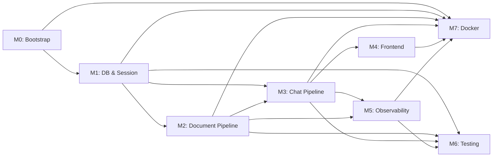

# RAG Chat System — Modular Implementation Plan

> **Stack:** NestJS · Next.js · PostgreSQL + pgvector · Redis · BullMQ · LangGraph · OpenAI · Langfuse
> **Total Budget:** 5 days · **8 hrs/day hard cap** · **40 hrs total**
> **Target:** P95 latency ≤ 2 s · Containerised · Login-free (session-based)

---

## Scope: MVP v1 vs. Deferred v2

> [!IMPORTANT]
> To hit a realistic 4-day window, a subset of features from the design doc is deferred to v2. **Nothing is dropped** — all items are planned, just sequenced.

| Feature | v1 (Days 1–4) | v2 (Post-launch) | Reason for Deferral |
|---------|:---:|:---:|---------------------|
| Project bootstrap + monorepo | ✅ | | |
| Prisma schema + pgvector indexes + tsvector trigger | ✅ | | |
| Session guard (x-session-id) | ✅ | | |
| Document upload (Multer, SHA-256, file types) | ✅ | | |
| BullMQ pipeline (parse → chunk → embed → store) | ✅ | | |
| Exponential backoff + stalled job recovery | ✅ | | |
| Status polling endpoint | ✅ | | |
| Document delete + ghost memory message | ✅ | | |
| **Cache invalidation on document delete** | ✅ | | |
| LangGraph orchestration (Router → Retrieval → Generator) | ✅ | | |
| Exact cache check (Redis) | ✅ | | |
| Hybrid search (RRF dense + sparse) | ✅ | | |
| SSE streaming (Server-Sent Events) | ✅ | | |
| Prompt assembly + safety caboose (anti-injection) | ✅ | | |
| Sliding window memory (last 4–6 messages) | ✅ | | |
| Guardrails (input VIOLATION, context score < 0.60) | ✅ | | |
| Rate limiting (10 msg/min per session) | ✅ | | |
| Retry endpoint (`POST /api/chat/retry`) | ✅ | | |
| Feedback endpoint + Langfuse score binding | ✅ | | |
| Langfuse tracing (core spans only) | ✅ | | |
| Next.js frontend (upload, chat, sidebar, SSE, feedback) | ✅ | | |
| Docker Compose (all 5 containers) | ✅ | | |
| Unit tests (critical paths) | ✅ | | |
| Integration tests (upload + chat E2E) | ✅ | | |
| **Semantic cache check** (cosine similarity in Redis) | | ✅ | Requires custom Redis vector logic — not a Redis built-in, adds complexity |
| **Reranking layer** (Cohere / local HuggingFace) | | ✅ | Latency budget risk; fallback path still works without it |
| **SummarizeMemoryNode** (running summary compression) | | ✅ | Edge case for long sessions; sliding window is sufficient for v1 |
| **DLQ Slack webhook alerting** | | ✅ | Log to Langfuse warnings first; Slack webhook is a quick follow-up |
| **Full eval pipeline** (50 golden Qs, LLM-as-a-Judge) | | ✅ | Skeleton set up in v1; full dataset + runner in v2 |
| **Session token budget guardrail** (100k token cap) | | ✅ | Low priority for initial deployment at small scale |
| **CI/CD GitHub Actions** (PR gate + nightly eval) | | ✅ | Pre-commit hooks (Husky) in v1 only |

---

## Timeline Overview

### At a Glance

| Module | What | Estimate |
|--------|------|:--------:|
| **M0** | Project Bootstrap & Infrastructure | 3 hrs |
| **M1** | Database & Session Foundation | 3 hrs |
| **M2** | Document Upload & Processing Pipeline | 7 hrs |
| **M3** | Chat Pipeline — Orchestration, Retrieval & Streaming | 9 hrs |
| **M4** | Frontend (Next.js) | 5 hrs |
| **M5** | Observability & Feedback | 3 hrs |
| **M6** | Testing Suite (unit + integration) | 4 hrs |
| **M7** | Docker Compose & Final Integration | 4 hrs |
| | **Total (execution)** | **38 hrs ≈ 4 days @ 8 hrs/day** |
| | **+ Buffer Day 5** | Bug fixes, polish, final validation |

### Time-Boxed @ 8 hrs/day Hard Cap

> [!IMPORTANT]
> Each day is a **hard 8-hour cap** · 5 days total · **40 hrs budget**. Modules spanning multiple days are split explicitly in the detailed schedule below.

| Module | What | Time Box | Day(s) |
|--------|------|:--------:|--------|
| **M0** | Project Bootstrap & Infrastructure | **3 hrs** | Day 1 |
| **M1** | Database & Session Foundation | **3 hrs** | Day 1 |
| **M2** | Document Upload & Processing Pipeline | **7 hrs** | Day 1 (2h) + Day 2 (5h) |
| **M3** | Chat Pipeline — Orchestration, Retrieval & Streaming | **9 hrs** | Day 2 (3h) + Day 3 (6h) |
| **M4** | Frontend (Next.js) | **5 hrs** | Day 4 |
| **M5** | Observability & Feedback | **3 hrs** | Day 3 (2h) + Day 4 (1h) |
| **M6** | Testing Suite (unit + integration) | **4 hrs** | Day 4 (2h) + Day 5 (2h) |
| **M7** | Docker Compose & Final Integration | **4 hrs** | Day 5 |
| | **Buffer** | **2 hrs** | Day 5 |
| | **Total** | **40 hrs** | **5 days × 8 hrs** |


---

## Day-by-Day Schedule — 8 hrs/day Hard Cap

| Day | Time | Module | Task | Hrs |
|-----|------|--------|------|-----|
| **Day 1** | 0:00–3:00 | M0 | Monorepo scaffold, NestJS + Next.js init, all deps installed, Swagger, ValidationPipe, env config | 3h |
| | 3:00–6:00 | M1 | Prisma schema (4 models), pgvector extension, HNSW + GIN indexes, tsvector trigger, PrismaService, session guard | 3h |
| | 6:00–8:00 | M2 start | Multer upload controller, SHA-256 dedup guard, file save to `/uploads/{session_id}/` | 2h |
| **Day 2** | 0:00–5:00 | M2 finish | BullMQ worker: parse → chunk → embed → store → status update → temp file cleanup; DLQ on fail; polling endpoint | 5h |
| | 5:00–8:00 | M3 start | LangGraph graph definition, RouterNode (gpt-4o-mini), exact Redis cache check, SSE headers | 3h |
| **Day 3** | 0:00–6:00 | M3 finish | RetrievalNode (hybrid RRF SQL), GeneratorNode (gpt-4o stream), prompt assembly (caboose), guardrails, retry endpoint, rate limiter, DB save | 6h |
| | 6:00–8:00 | M5 start | `LangfuseService`: createTrace, createSpan, finalizeTrace — wired into M3 pipeline | 2h |
| **Day 4** | 0:00–1:00 | M5 finish | Feedback endpoint + score binding to Langfuse; eval skeleton (`golden-dataset.json` stub) | 1h |
| | 1:00–6:00 | M4 | Full Next.js UI: upload panel + polling, SSE chat + streaming, sidebar, citation pills, thumbs feedback, stop-generating, dark mode | 5h |
| | 6:00–8:00 | M6 | Unit tests: chunking edge cases, prompt assembly order, SHA-256 dedup, routing mock, Langfuse mock | 2h |
| **Day 5** *(Buffer)* | 0:00–2:00 | M6 finish | 2 Supertest E2E: upload pipeline + chat SSE flow; Husky pre-commit hook | 2h |
| | 2:00–6:00 | M7 | `docker-compose.yml`, backend + frontend Dockerfiles, `init-db.sql`, health checks, volume mounts | 4h |
| | 6:00–8:00 | Buffer | End-to-end manual validation checklist; bug fixes; final cleanup | 2h |

---

## Risk Register (Known Time Sinks)

| Risk | Module | Impact | Mitigation |
|------|--------|--------|------------|
| Prisma `Unsupported` vector type friction | M1 | +1 hr | Use `$executeRaw` for all vector inserts from day one |
| BullMQ stalled job + lock renewal config | M2 | +1 hr | Copy proven config from BullMQ docs verbatim; test with a forced crash |
| LangGraph TypeScript graph definition & state typing | M3 | +2 hrs | Define `StateAnnotation` schema first before writing any nodes |
| SSE streaming in NestJS with `@Res()` | M3 | +1 hr | Use Express `res.write` / `res.end` directly; avoid NestJS response interceptors on this route |
| RRF hybrid SQL query debugging | M3 | +1–2 hrs | Test the raw SQL against seeded data in pgAdmin before wiring into Prisma `$queryRaw` |
| Langfuse Docker container startup order | M7 | +1 hr | Add explicit `depends_on: postgres: condition: service_healthy` |
| Container networking (NestJS → Postgres/Redis/Langfuse) | M7 | +1 hr | Use service names as hostnames; validate with `docker compose exec` |

---

## M0 — Project Bootstrap & Infrastructure
**Realistic Est. ~3–4 hrs** | Day 1 Morning

### Goals
Monorepo structure, tooling, shared environment config, Swagger, global validation pipe.

### Deliverables

#### [NEW] `/backend` — NestJS skeleton
- `nest new backend --package-manager npm`
- Install: `@nestjs/config`, `@prisma/client`, `prisma`, `ioredis`, `bullmq`, `@nestjs/bull`, `@nestjs/swagger`, `multer`, `@types/multer`, `langchain`, `@langchain/openai`, `@langchain/langgraph`, `langfuse`, `class-validator`, `class-transformer`, `@nestjs/throttler`
- `SwaggerModule` globally configured
- `ValidationPipe` globally configured
- `env.config.ts` — validated with Joi or `class-validator`

#### [NEW] `/frontend` — Next.js skeleton
- `npx create-next-app@latest frontend --typescript --app`
- Install: `axios`, `react-markdown`, `remark-gfm`, `uuid`, `@types/uuid`

#### [NEW] `/.env.example`
```
POSTGRES_USER=admin
POSTGRES_PASSWORD=your_password
POSTGRES_DB=rag_database
OPENAI_API_KEY=sk-...
LANGFUSE_PUBLIC_KEY=pk-lf-...
LANGFUSE_SECRET_KEY=sk-lf-...
LANGFUSE_HOST=http://langfuse-server:3000
REDIS_HOST=redis
REDIS_PORT=6379
NEXTAUTH_SECRET=...
SALT=...
NEXT_PUBLIC_API_URL=http://localhost:8080
```

#### [NEW] `/.gitignore`

### Key Files Created
```
/
├── backend/src/
│   ├── app.module.ts
│   ├── common/
│   │   ├── filters/           # Global HTTP exception filter
│   │   └── interceptors/      # Request logging interceptor
│   └── config/
│       └── env.config.ts
├── frontend/
├── .env.example
└── .gitignore
```

---

## M1 — Database & Session Foundation
**Realistic Est. ~3–4 hrs** | Day 1 Afternoon

### Goals
Full Prisma schema, pgvector + GIN indexes, tsvector trigger, session upsert guard.

### Deliverables

#### [NEW] `prisma/schema.prisma`

| Model | Key Columns | Notes |
|-------|-------------|-------|
| `Session` | `id (String PK)`, `runningSummary?`, `createdAt`, `updatedAt` | v2: `runningSummary` column exists but NodeSummarize logic deferred |
| `Document` | `id (uuid)`, `sessionId`, `filename`, `fileHash (sha256)`, `status (Enum)`, `errorMessage?`, `jobId`, `tokenCount?` | |
| `DocumentChunk` | `id (uuid)`, `documentId`, `sessionId`, `content`, `metadata (Json?)`, `embedding vector(1536)`, `searchVector tsvector` | |
| `Message` | `id (uuid)`, `sessionId`, `role`, `content`, `traceId?`, `citations (Json?)`, `createdAt` | `traceId` links to Langfuse |

> [!IMPORTANT]
> `Document.status` Enum: `PENDING | PROCESSING | COMPLETED | FAILED`
> `Document.fileHash` (SHA-256) is the deduplication key — add a unique constraint on `(sessionId, fileHash)`.

#### [NEW] `prisma/migrations/` + manual SQL
```sql
-- HNSW index for ultra-fast dense vector cosine search
CREATE INDEX document_chunks_embedding_idx
  ON document_chunks USING hnsw (embedding vector_cosine_ops);

-- GIN index for keyword full-text search
CREATE INDEX document_chunks_search_idx
  ON document_chunks USING GIN (search_vector);

-- Auto-populate tsvector on insert/update
CREATE OR REPLACE FUNCTION tsvector_update_trigger() RETURNS trigger AS $$
BEGIN
  NEW.search_vector := to_tsvector('pg_catalog.english', NEW.content);
  RETURN NEW;
END $$ LANGUAGE plpgsql;

CREATE TRIGGER tsvectorupdate
  BEFORE INSERT OR UPDATE ON document_chunks
  FOR EACH ROW EXECUTE FUNCTION tsvector_update_trigger();
```

#### [NEW] `src/modules/prisma/`
- `prisma.module.ts` — global singleton (`isGlobal: true`)
- `prisma.service.ts` — `onModuleInit` connects, `onModuleDestroy` disconnects
- `prisma.service.spec.ts`

#### Session Guard
- NestJS `SessionGuard` extracts `x-session-id` header
- Missing header → `400 Bad Request`
- Upserts `Session` row via `prisma.session.upsert()`
- Applied globally except health-check route

---

## M2 — Document Upload & Processing Pipeline
**Realistic Est. ~6–8 hrs** | Day 2

### Goals
File upload validation → local save → BullMQ queue → background parse/chunk/embed/store → status polling → delete with cache invalidation + ghost memory.

### Deliverables

#### [NEW] `src/modules/document/`

| File | Responsibility |
|------|----------------|
| `document.controller.ts` | `POST /api/documents/upload` · `GET /api/documents/status/:jobId` · `DELETE /api/documents/:documentId` |
| `document.controller.spec.ts` | Mock service unit tests |
| `document.service.ts` | SHA-256 hash check, Multer save, BullMQ job push, delete cascade + Redis invalidation + ghost memory |
| `document.service.spec.ts` | Duplicate detection, ghost memory insert |
| `document.module.ts` | |

**Upload Validation (Multer guard):**
- Accept: `.txt | .csv | .md | .pdf`
- Reject: all other MIME types → `415 Unsupported Media Type`
- Max size: 10 MB → `413`
- SHA-256 of file buffer → if `(sessionId, fileHash)` exists → `409 Conflict`

**File Storage:**
```
/uploads/{session_id}/{uuid}-{sanitised_filename}
```

#### [NEW] `src/modules/worker/`

| File | Responsibility |
|------|----------------|
| `document.processor.ts` | BullMQ `@Process()`: validate → parse → chunk → embed → store → cleanup |
| `document.processor.spec.ts` | Chunking edge cases: empty, single char, huge unbroken block, binary |
| `vector.service.ts` | OpenAI batch embed + `prisma.$executeRaw` bulk insert |
| `vector.service.spec.ts` | Mock OpenAI, verify insert payload |
| `worker.module.ts` | BullMQ `registerQueue` config |

**BullMQ Job Config:**
```ts
{
  attempts: 3,
  backoff: { type: 'exponential', delay: 2000 },
  removeOnComplete: true,
  removeOnFail: false,   // Keep in 'failed' set for DLQ inspection
  lockDuration: 30000,
}
```

**Stalled Job Recovery:**
- `maxStalledCount: 2` — prevents infinite crash loops
- Lock auto-renewed every 15 s while job is active

**DLQ Alerting (v1 = Langfuse warning log):**
- On job `failed` event after exhausting all retries → update `Document.status = FAILED`, write `errorMessage`
- Log a `WARNING` level event to Langfuse (v2: add Slack webhook when `failed.length > 10`)

**Processing Phases:**
1. Re-validate file presence & type
2. Parse with LangChain Loader (TextLoader / CSVLoader / PDFLoader)
3. Check token count → reject if > 50 000 tokens (`413`)
4. Chunk: `RecursiveCharacterTextSplitter` (size: 1000, overlap: 200)
5. Batch embed all chunks via `text-embedding-3-small`
6. Bulk insert into `document_chunks` (`$executeRaw`) with `sessionId`, `documentId`, dense vector, content (tsvector auto-triggers)
7. Update `Document.status = COMPLETED`
8. Delete temp file from `/uploads`

**DELETE Flow (`DELETE /api/documents/:documentId`):**
1. Prisma cascade delete → wipes all `DocumentChunk` rows
2. Flush Redis keys matching `session:{session_id}:*`
3. Insert `system` role `Message` row:
   ```
   "[SYSTEM DIRECTIVE: Document '{filename}' has been deleted. Ignore facts from it in prior history.]"
   ```

---

## M3 — Chat Pipeline (Orchestration · Retrieval · Streaming)
**Realistic Est. ~8–10 hrs** | Day 3

### Goals
Full RAG chat pipeline with LangGraph orchestration, hybrid RRF search, SSE streaming, prompt assembly with anti-injection caboose, retry, rate limiting, and feedback.

> [!WARNING]
> This is the highest-risk module. LangGraph's TypeScript API, the RRF SQL query, and NestJS SSE together have several known gotchas. Budget the full 10 hours.

### Deliverables

#### [NEW] `src/modules/chat/`

| File | Responsibility |
|------|----------------|
| `chat.controller.ts` | `POST /api/chat` · `POST /api/chat/retry` · `POST /api/chat/feedback` |
| `chat.controller.spec.ts` | Rate limit rejection, SSE header assertion |
| `chat.service.ts` | Full pipeline orchestration |
| `chat.service.spec.ts` | Prompt assembly order, routing mock, sliding window |
| `chat.module.ts` | |

---

### Pipeline Flow

```
POST /api/chat  { message, session_id }
  │
  ├─ 1. Rate limit: 10 msg/min per session_id (Redis counter, @nestjs/throttler)
  ├─ 2. Save user Message to DB (immediate — before any LLM call)
  ├─ 3. Set SSE response headers
  │       Content-Type: text/event-stream
  │       Cache-Control: no-cache
  │       Connection: keep-alive
  ├─ 4. Exact cache check
  │       Key: sha256(session_id + prompt)
  │       HIT → res.write(cached) → res.end()
  ├─ 5. Embed user prompt (text-embedding-3-small → 1536-dim vector)
  ├─ 6. Langfuse: createTrace(session_id, prompt)
  │
  └─ 7. LangGraph Graph (StateAnnotation: { messages[], chunks[] })
        │
        ├─ RouterNode  [gpt-4o-mini, JSON output]
        │     { "route": "GREETING" | "RAG_QUERY" | "VIOLATION" }
        │     ├─ GREETING  → GeneratorNode (skip retrieval)
        │     ├─ VIOLATION → write canned refusal → res.end()
        │     └─ RAG_QUERY → RetrievalNode
        │
        ├─ RetrievalNode
        │     Hybrid RRF SQL (via prisma.$queryRaw):
        │       • Semantic  : top-20 by cosine distance (pgvector <=>)
        │       • Keyword   : top-20 by ts_rank_cd (tsvector @@)
        │       • RRF merge : FULL OUTER JOIN, score sum, LIMIT 50
        │     → top-5 chunks (no reranker in v1 — raw RRF score)
        │     Guardrail: if top chunk score < 0.60 → canned reply
        │
        └─ GeneratorNode (gpt-4o, stream: true)
              Prompt Array (strict order = anti-injection caboose):
                [1] SystemMessage: grounding rules + citation format
                [2] HumanMessage: "Context:\n{chunk1}\n{chunk2}..."
                [3] AIMessage:   runningSummary (if exists)
                [4..N] last 4–6 Messages from DB (sliding window)
                [N+1]  HumanMessage: user's current question  ← LAST (caboose)
              │
              ├─ Stream tokens: res.write(`data: ${token}\n\n`)
              ├─ Buffer fullResponse in memory
              └─ On [DONE] event (all async, non-blocking):
                    • res.end()
                    • Save assistant Message to DB (with traceId)
                    • Write exact cache to Redis (TTL: 24h)
                    • Langfuse: finalizeTrace (prompt, output, tokens, cost)
```

#### Retry (`POST /api/chat/retry`)
1. Delete last assistant `Message` from DB for this session
2. Fetch the immediately preceding user `Message` content
3. Run the pipeline with `skipCache: true` and `temperature: 0.4`
4. Tag Langfuse trace: `tags: ["retry"]`

#### Feedback (`POST /api/chat/feedback`)
- Payload: `{ trace_id: string, score: 1 | -1 }`
- Forward to `langfuse.score(trace_id, "user-feedback", score)`

#### Rate Limiting
- `@nestjs/throttler` with Redis store
- TTL: 60 s, limit: 10 per `session_id`

---

## M4 — Frontend (Next.js)
**Realistic Est. ~7–9 hrs** | Day 4 (first half)

### Goals
Premium, responsive dark-mode UI: drag-and-drop upload, SSE streaming chat, sidebar history, citation pills, thumbs feedback, stop-generating.

### File Structure
```
/frontend/src/
├── app/
│   ├── layout.tsx               # Root layout, session init, Google Font
│   ├── page.tsx                 # Landing + upload
│   └── chat/page.tsx            # Chat dashboard
├── components/
│   ├── UploadPanel/
│   │   ├── UploadPanel.tsx      # Drag-and-drop zone, file picker
│   │   └── FileProgress.tsx     # Per-file status + polling every 2s
│   ├── Chat/
│   │   ├── ChatWindow.tsx       # Message list, auto-scroll
│   │   ├── MessageBubble.tsx    # User / AI bubbles + citation badge pills
│   │   ├── ChatInput.tsx        # Textarea, send, stop-generating button
│   │   └── FeedbackBar.tsx      # Thumbs up/down (stores traceId)
│   ├── Sidebar/
│   │   ├── Sidebar.tsx          # Session history list
│   │   └── HistorySearch.tsx    # Debounced search filter
│   └── common/
│       └── StatusBadge.tsx      # PENDING / PROCESSING / COMPLETED / FAILED
├── hooks/
│   ├── useSession.ts            # localStorage UUID management
│   ├── useUpload.ts             # Multipart POST + 2s polling
│   └── useChat.ts               # SSE fetch + AbortController + retry
├── lib/
│   ├── api.ts                   # Axios baseURL + x-session-id interceptor
│   └── types.ts                 # Message, Document, Session interfaces
└── styles/
    └── globals.css              # Design tokens, dark theme, glassmorphism
```

### Key UI Behaviours

| Behaviour | Detail |
|-----------|--------|
| Session init | `useSession`: read localStorage → generate UUIDv4 if absent |
| Upload | Drag-and-drop + file dialog; client-side: type + size guard before POST |
| Processing lock | Chat input `disabled` while any doc is `PROCESSING` |
| SSE streaming | `fetch()` with `ReadableStream`; AbortController for stop-generating |
| Progressive render | `react-markdown` re-renders on each token chunk |
| Citations | Regex strips `[Page N]` / `[chunk_id]` tokens → renders as pill badges |
| Stop generating | AbortController cancels fetch; partial buffer saved to DB |
| Retry | Icon below AI bubble; calls `POST /api/chat/retry` |
| Thumbs | Highlighted on click; disabled after first vote; calls feedback endpoint |
| Sidebar | Session list from localStorage + DB messages on click |
| Dark mode | Default; HSL-based design tokens; no system preference toggle needed |

---

## M5 — Observability & Feedback
**Realistic Est. ~3–4 hrs** | Day 4 (second half)

### Goals
Langfuse tracing on all critical spans; feedback score binding; eval skeleton.

### Deliverables

#### [NEW] `src/modules/observability/`

| File | Responsibility |
|------|----------------|
| `langfuse.service.ts` | `createTrace()`, `createSpan()`, `finalizeTrace()`, `score()` |
| `langfuse.service.spec.ts` | Mock SDK, verify span data |
| `observability.module.ts` | |

**Trace Spans:**

| Span | Data Logged |
|------|-------------|
| `routing` | Route classification, model used, latency |
| `retrieval` | Top-5 chunk IDs, cosine scores, keyword scores |
| `generation` | Full prompt array, full output, token count, estimated cost, latency |
| `feedback` | score (`1`/`-1`) bound via `langfuse.score()` to `trace_id` |

#### [NEW] `test/evals/` — Skeleton only (v1)

| File | v1 State |
|------|----------|
| `datasets/golden-dataset.json` | 5–10 seed Q&A pairs to validate structure |
| `scripts/run-evals.ts` | Script stub with TODO comments; wired to full implementation in v2 |
| `retrieval-quality.spec.ts` | 1 passing smoke test against seeded data |

---

## M6 — Testing Suite
**Realistic Est. ~5–6 hrs** | Day 4

### Unit Tests (Jest)

| Test File | What It Covers |
|-----------|----------------|
| `prisma.service.spec.ts` | Connect/disconnect lifecycle |
| `document.service.spec.ts` | SHA-256 dedup (409), ghost memory message insert, status transitions |
| `document.processor.spec.ts` | Chunking: empty `""`, single char, huge unbroken block, corrupted binary |
| `vector.service.spec.ts` | Batch embed mock, `$executeRaw` payload structure |
| `chat.service.spec.ts` | Prompt array order (caboose last), GREETING route skip, guardrail intercept |
| `langfuse.service.spec.ts` | Span create/finalize/score (mock SDK) |

**Coverage targets:**
- Global: **≥ 80%**
- Chunking + prompt assembly + routing: **100%**

### Integration Tests (Supertest)

| File | Pipeline Covered |
|------|-----------------|
| `test/integration/document.e2e-spec.ts` | POST upload → BullMQ → DB status = COMPLETED |
| `test/integration/chat.e2e-spec.ts` | POST /chat → SSE token stream received → Message saved |
| `test/integration/jest-e2e.json` | Points to test Postgres DB (separate schema) |

### CI/CD (v1 = pre-commit hooks only)
- `husky` + `lint-staged`: run unit tests on every commit
- v2: GitHub Actions for PR gate + nightly eval cron

---

## M7 — Docker Compose & Final Integration
**Realistic Est. ~4–5 hrs** | Day 5 (Buffer)

### Goals
Containerise all 5 services; validate full end-to-end flow via checklist.

### Deliverables

#### [NEW] `docker-compose.yml`

| Service | Image | Port |
|---------|-------|------|
| `rag_postgres` | `ankane/pgvector:latest` | 5432 |
| `rag_redis` | `redis:7-alpine` | 6379 |
| `rag_langfuse` | `langfuse/langfuse:latest` | 3000 |
| `rag_nestjs` | Custom `backend/Dockerfile` | 8080 |
| `rag_nextjs` | Custom `frontend/Dockerfile` | 3001 |

- All services use `depends_on` with `condition: service_healthy` where applicable
- `rag_nestjs` runs `npx prisma migrate deploy && node dist/main.js` on startup
- `./uploads:/app/uploads` volume mounted to NestJS

#### [NEW] `backend/Dockerfile` — Multi-stage
```dockerfile
FROM node:20-alpine AS builder
WORKDIR /app
COPY package*.json ./
RUN npm ci
COPY . .
RUN npm run build

FROM node:20-alpine AS runner
WORKDIR /app
COPY --from=builder /app/dist ./dist
COPY --from=builder /app/node_modules ./node_modules
COPY --from=builder /app/prisma ./prisma
CMD ["sh", "-c", "npx prisma migrate deploy && node dist/main.js"]
```

#### [NEW] `frontend/Dockerfile` — Next.js standalone
#### [NEW] `init-db.sql` — HNSW + GIN indexes + tsvector trigger (runs on first Postgres start)

### Final Integration Validation Checklist
- [ ] `docker compose up --build` — all 5 containers reach healthy state
- [ ] Prisma migrations apply without error
- [ ] Upload `.pdf` → status polls: `PENDING → PROCESSING → COMPLETED`
- [ ] 10 MB file accepted; 11 MB rejected with 413
- [ ] Duplicate file upload returns 409
- [ ] Chat sends message → SSE tokens stream → full response rendered
- [ ] First token appears within 2 seconds (P95 target)
- [ ] Retry regenerates a different response
- [ ] Thumbs-down appears as score `-1` in Langfuse dashboard
- [ ] Delete document → next query returns "document unavailable" ghost message
- [ ] 11th message in 1 minute returns 429 Too Many Requests
- [ ] `docker compose down -v && docker compose up` — data persists via volumes

---

## Dependency Map



---

## Open Questions / Decisions Needed

> [!IMPORTANT]
> **Reranker:** Cohere Rerank 3 (easy cloud API, ~$0.001/call) vs. local HuggingFace cross-encoder (zero cost, +200–400ms latency). Design says local-first — recommend **deferring to v2** and using raw RRF top-5 for v1.

> [!IMPORTANT]
> **Eval Strategy:** Custom RAGAS mimic (TS), Langfuse cloud evals, Python microservice, or **Promptfoo** (recommended — TS-native, no extra service). Confirm before starting M5.

> [!NOTE]
> **Conversational Memory:** Sliding window (last 4–6 messages) in v1. `SummarizeMemoryNode` deferred to v2 — `runningSummary` column exists in schema, just unused initially.

> [!NOTE]
> **CI/CD Platform:** Husky pre-commit hooks in v1. GitHub Actions in v2. Confirm if a different platform (GitLab CI, Bitbucket) is needed.
